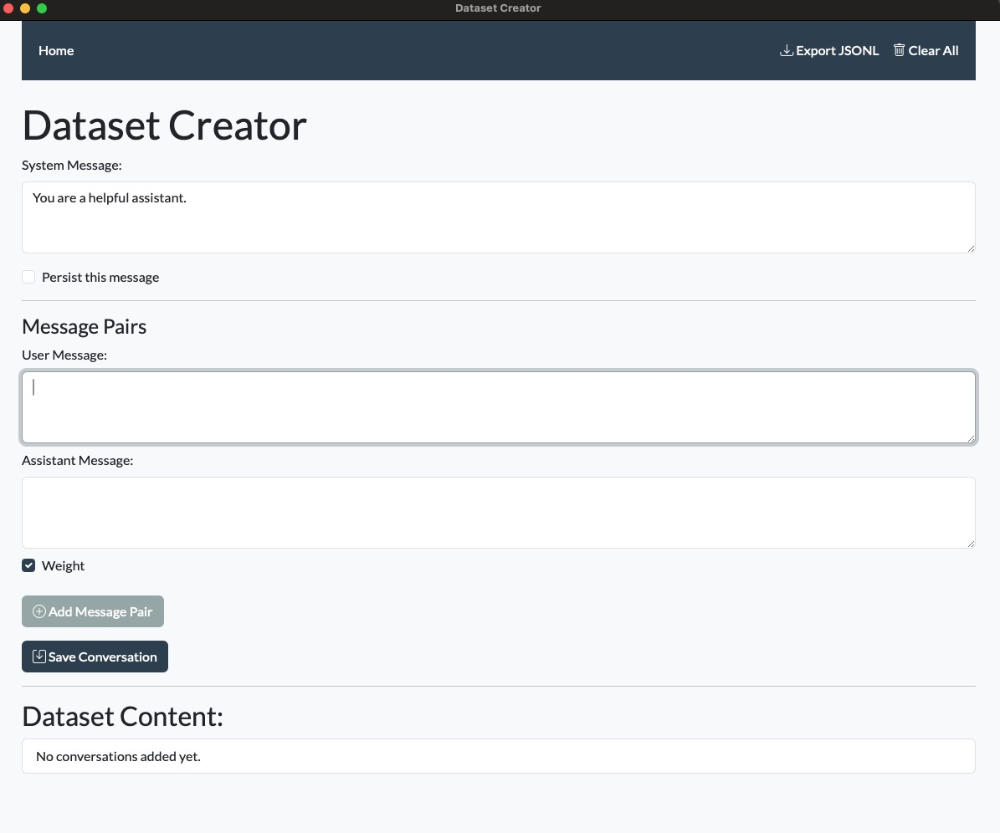
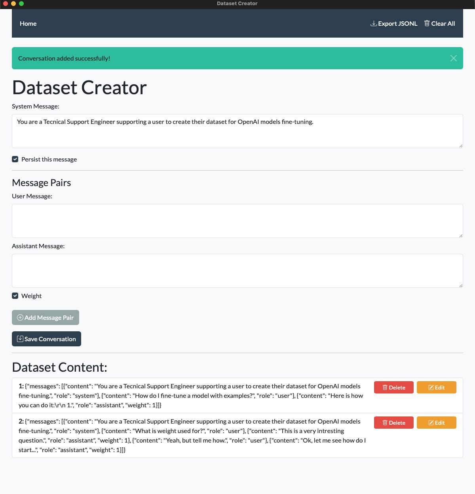
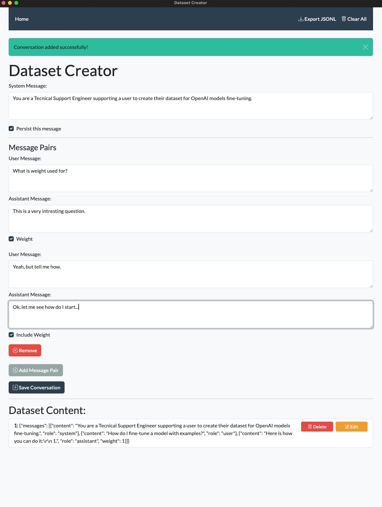

# Dataset Creator App

## Overview

The **Dataset Creator App** is a user-friendly tool designed to help you prepare datasets for fine-tuning OpenAI language models. It provides an intuitive interface for creating and managing conversation data in the format required by OpenAI's fine-tuning guidelines.

## Motivation

Fine-tuning language models requires datasets in a specific format, which can be time-consuming to create manually. This app was developed to streamline the dataset creation process, allowing you to focus on crafting high-quality training data without worrying about formatting details.

For more information on preparing your dataset for fine-tuning, please refer to OpenAI's official documentation: [Preparing your dataset](https://platform.openai.com/docs/guides/fine-tuning/preparing-your-dataset)

## Features

- **Add and Edit Conversations**: Easily create new conversation pairs or modify existing ones.
- **Export to JSONL**: Export your dataset in JSON Lines format (`.jsonl`), which is required for OpenAI fine-tuning.
- **Persistent Storage**: Your conversations are saved locally, so you can resume your work anytime.
- **Simple Interface**: Intuitive design makes it accessible for users with any level of technical expertise.

## Download

You can download the app here:

- [Download DatasetCreator-MACOS.zip](https://github.com/rimom/DatasetCreator/releases/latest/download/DatasetCreator-MACOS.zip)

*Note: Currently, the app is available for macOS. Support for other operating systems may be added in the future.*

## Installation

1. **Download the App**: Click the link above to download `DatasetCreator-MACOS.zip`.
2. **Unzip the File**: Extract `DatasetCreator.app` from the ZIP file.
3. **Move to Applications Folder** (Optional): Drag and drop `DatasetCreator.app` into your Applications folder for easy access.
4. **Security Permissions**:
   - Since the app is not signed by an identified developer, you might encounter a security warning.
   - To bypass this, right-click on `DatasetCreator.app` and select **Open**.
   - In the dialog that appears, click **Open** again to confirm.

## Usage

1. **Launch the App**: Double-click on `DatasetCreator.app` to open it.
2. **Create Conversations**:
   - By default, the app provides a single pair of user-assistant messages.
   - Enter your **User Message** and the corresponding **Assistant Response** in the provided fields.
   - If you want to create **multi-turn conversations** (conversations with multiple user and assistant messages), click **Add Message Pair** to add more turns.
3. **Edit Conversations**:
   - Click the **Edit** button next to a conversation to modify it.
   - Make your changes and save.
4. **Export Dataset**:
   - Click on **Export JSONL** to save your dataset.
   - Choose a destination folder and filename for your `.jsonl` file.
5. **Prepare for Fine-Tuning**:
   - Use the exported `dataset.jsonl` file as input for fine-tuning your OpenAI model.
   - Follow the guidelines provided by OpenAI to proceed with fine-tuning.

## Clarifications on Usage

- **Single-turn conversations**: You can add a single user message and a single assistant response without using the **Add Message Pair** button.
- **Multi-turn conversations**: If your dataset requires multiple exchanges between the user and assistant (for example, a dialogue with back-and-forth responses), click the **Add Message Pair** button to add as many turns as needed.

## Screenshots

*Main Interface*

 

*Adding a New Conversation*

 

*Exporting Dataset to JSONL*

## Contributing

Contributions are welcome! If you have ideas for improvements or encounter any issues, please open an issue or submit a pull request.

## License

MIT License with Contribution Clause

Permission is hereby granted, free of charge, to any person obtaining a copy of this software and associated documentation files (the "Software"), to deal in the Software without restriction, including without limitation the rights to use, copy, modify, merge, publish, distribute, sublicense, and/or sell copies of the Software, and to permit persons to whom the Software is furnished to do so, subject to the following conditions:

1. Any person who forks, modifies, or creates derivative works based on this Software must submit a pull request to the original repository of the Software with their modifications, enhancements, or improvements, unless explicitly exempted in writing by the original author(s).

2. The above copyright notice and this permission notice shall be included in all copies or substantial portions of the Software.

THE SOFTWARE IS PROVIDED "AS IS", WITHOUT WARRANTY OF ANY KIND, EXPRESS OR IMPLIED, INCLUDING BUT NOT LIMITED TO THE WARRANTIES OF MERCHANTABILITY, FITNESS FOR A PARTICULAR PURPOSE, AND NONINFRINGEMENT. IN NO EVENT SHALL THE AUTHORS OR COPYRIGHT HOLDERS BE LIABLE FOR ANY CLAIM, DAMAGES, OR OTHER LIABILITY, WHETHER IN AN ACTION OF CONTRACT, TORT, OR OTHERWISE, ARISING FROM, OUT OF, OR IN CONNECTION WITH THE SOFTWARE OR THE USE OR OTHER DEALINGS IN THE SOFTWARE.

---

**Disclaimer**: This app is an independent project and is not officially affiliated with OpenAI.
